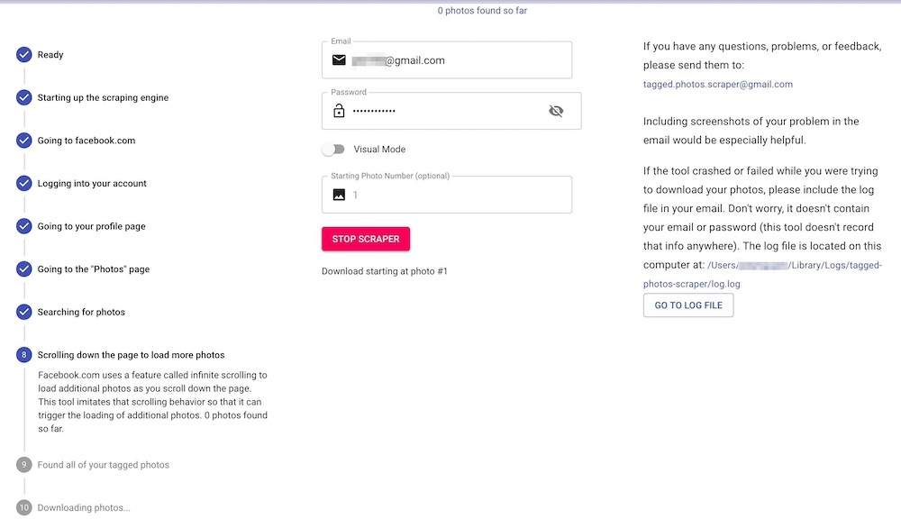

# Tagged Photos Scraper

## Installation instructions

Follow the instructions for your particular operating system below:

- [Windows](installation-windows.md)
- [MacOS](installation-mac.md)
- [Linux](installation-linux.md)

## What this tool does

This tool's sole function is to download all of the photos you've been tagged in on Facebook to your computer.  It **doesn't** track you, look at your personal data or your friends' data, save your login info for me or anyone else to use later, or anything else. If you’re someone who knows how to read and understand JavaScript, you can explore the code yourself to verify.  Or ask your friendly neighborhood web/software developer to take a look (buy her/him a coffee, beer, boba tea, or their BEVERAGE_OF_CHOICE as thanks).

To be extra careful, I recommend using this tool only on your own personal home network and not on a public WiFi network like a coffee shop.

The speed of your computer and WiFi play a big part in how fast/stable this tool performs.

As far as I know, this tool only supports users using the United States version of the Facebook.com website. I don't know whether or not international users will be able to benefit from it, but feel free to try it out if you're not in the U.S. and let me know how it goes for you!

## Why this tool exists

Currently, Facebook gives you the ability to download full photo albums that you yourself have uploaded to your Facebook account. This [video](https://www.youtube.com/watch?v=Qw6g1Db48Ok) shows you how to do that. You can also download [all of the data about your account history](https://www.facebook.com/settings?tab=your_facebook_information). However, as far as I know, at this moment there's no option on Facebook.com or through their mobile app for you to download all of the photos that you've been **tagged** in by others.

Reasons why you may want to download your tagged photos:

- You want to print out the photos for a physical photo album and want the best quality version available on Facebook.
- You want a local copy so that you can view offline.
- You're worried a Facebook bug will occur where they lose the photos you're tagged in.
- You're afraid a friend may deactivate or delete their account, and you'll no longer have access to the photos they tagged you in.
- Facebook may (rightly or wrongly) think that you violated one of their terms of service for whatever reason and choose to close your account which means you'll lose access to all the photos you're tagged in.
- You may want to close your Facebook account.

## Why I decided to build it

I wanted to find a solution to a need that I felt was unaddressed.  In the past, I found different implementations that others built, such as another third party app that connected to Facebook, an [IFTTT](https://ifttt.com/) applet, and a browser extension, but they all had limitations that weren't acceptable to me:

- The IFTTT applet I found only worked for **new** photos you got tagged in, not existing ones.
- The browser extension gave me very low quality versions of my photos (it only downloaded the thumbnail versions, not the full quality ones).
- Both the third party app and browser extension had code that was closed-source so I couldn't see how they worked and confirm that they weren't doing something unscrupulous or nefarious with my account.

The other reason I built this tool was to get my hands dirty and learn some technologies that I've been interested in, specifically Electron.js and Puppeteer.  For a software developer, like any other profession that involves creating things, the best way to learn a new skill is to create something with it. This project gave me a good opportunity to do that.  So mostly, I built this tool for myself, but once I had it working for me, I figured others would find it useful as well so I built a user interface so that non-developers can ue it as well. And since it's open-source, anyone who wants to see how it's built or want to build a similar tool can reference the code.

## Acknowledgments

I was able to build this app thanks to the work of many other open-source projects.

### Technologies used that were created by big companies you may know

- Puppeteer by Google - web scraping technology used to emulate a user navigating to and around a website
- Electron by Github - software to enable using web technologies to build desktop apps
- React.js by Facebook - JavaScript framework responsible for building the user interface
- Material Design by Google - design guide used to make the UI look nice

### Technologies built by everyday software developers, designers, QAs, and many others

- Material-UI
- Formik
- Yup.js
- and many others listed in the *package.json* file

### Design

The icon used for this app was free and downloaded at -  https://www.iconfinder.com/icons/1936908/camera_instagram_photo_polaroid_selfie_shoot_icon.
