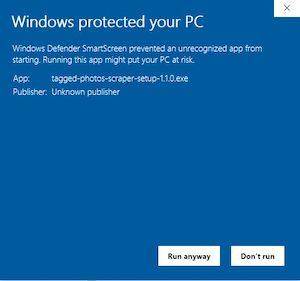

# How to install this app on Windows

On the [release page](https://github.com/joeynguyen/tagged-photos-scraper/releases), for the newest version available, download the file with the filename that ends with **.exe**.

Double-click the file to install and run it.

For some of you, the app may run fine right away. If so, proceed to using it. However, some of you will see the warning in the screenshot below that "Windows protected your PC" when you first try to run it.

This is because I chose not to pay for a [code signing certificate](https://docs.microsoft.com/en-us/windows-hardware/drivers/dashboard/get-a-code-signing-certificate). Since I'm developing this application and releasing for free to the public, I'm choosing not to go through the extra headache and costs of doing that.

To bypass Window's warning, simply click the "More info" link on that warning". It will then show you a "Run anway" button for you to click.

The app should install and run as normal now. If you want to find where it's located, on Windows 10, the app should be installed to your user home folder > AppData > Local > Programs > tagged-photos-scraper (I haven't tried seeing where it installs to on Windows 7 and older versions). There's also an uninstall file in that folder if you wish to uninstall the app once you're done using it. (You should do that to save space on your computer.)
